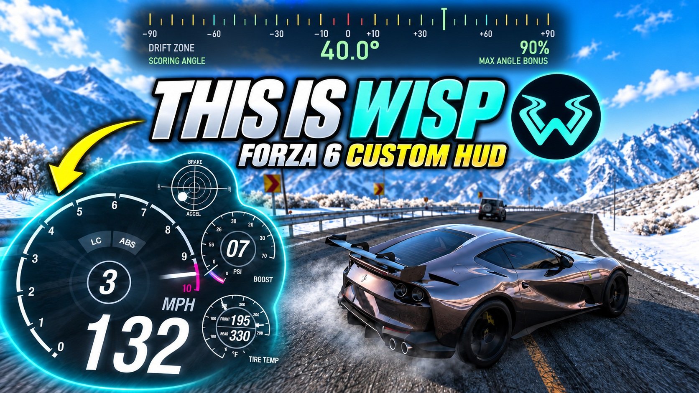
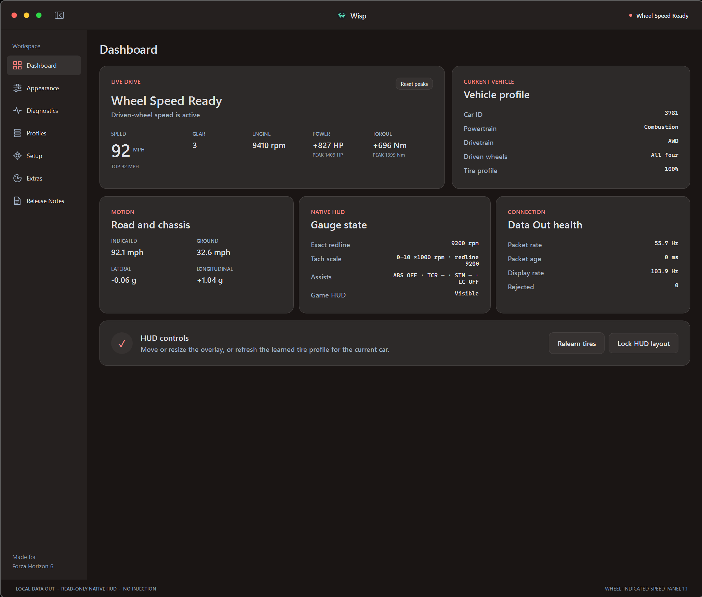
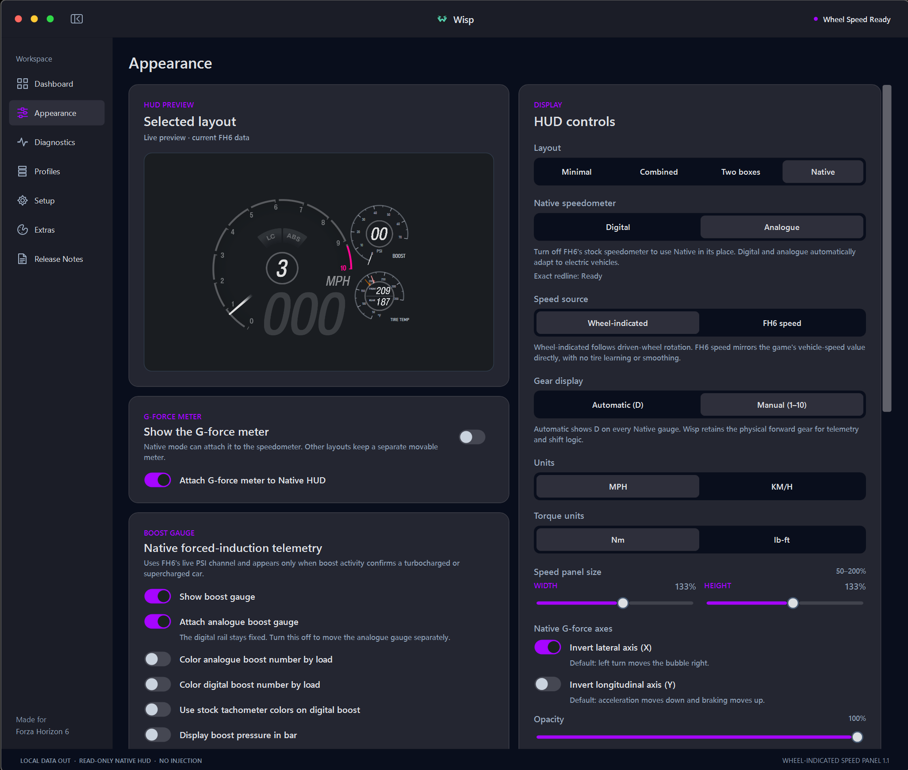
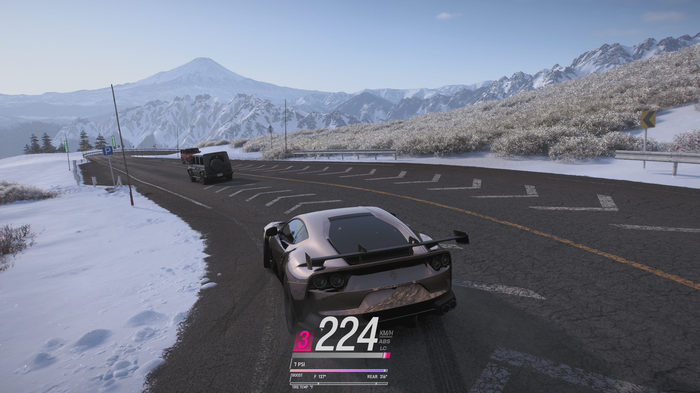
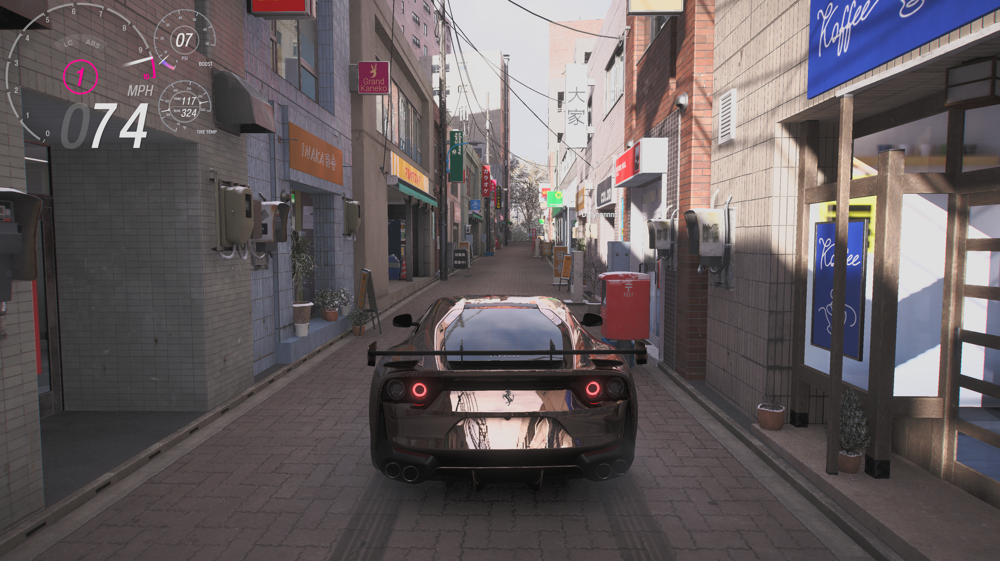
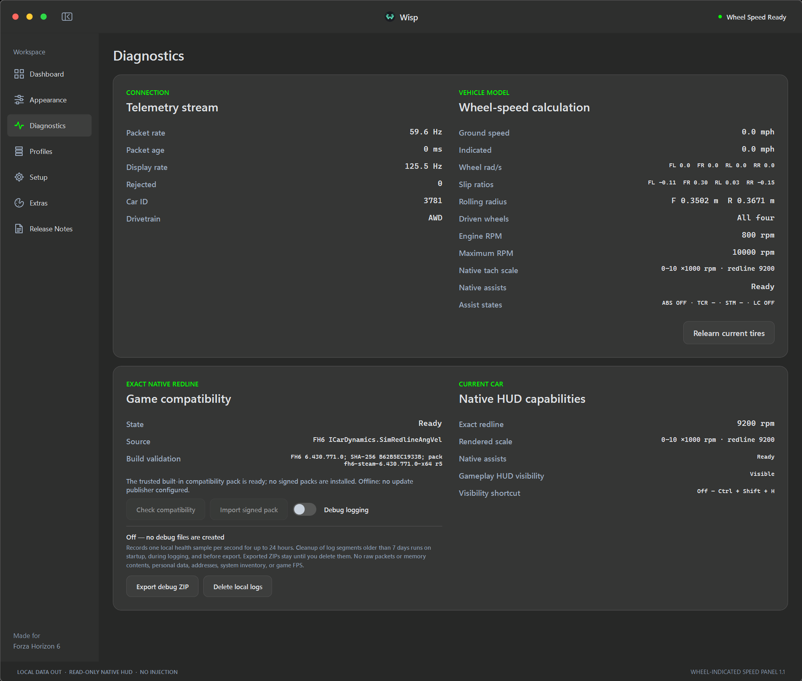
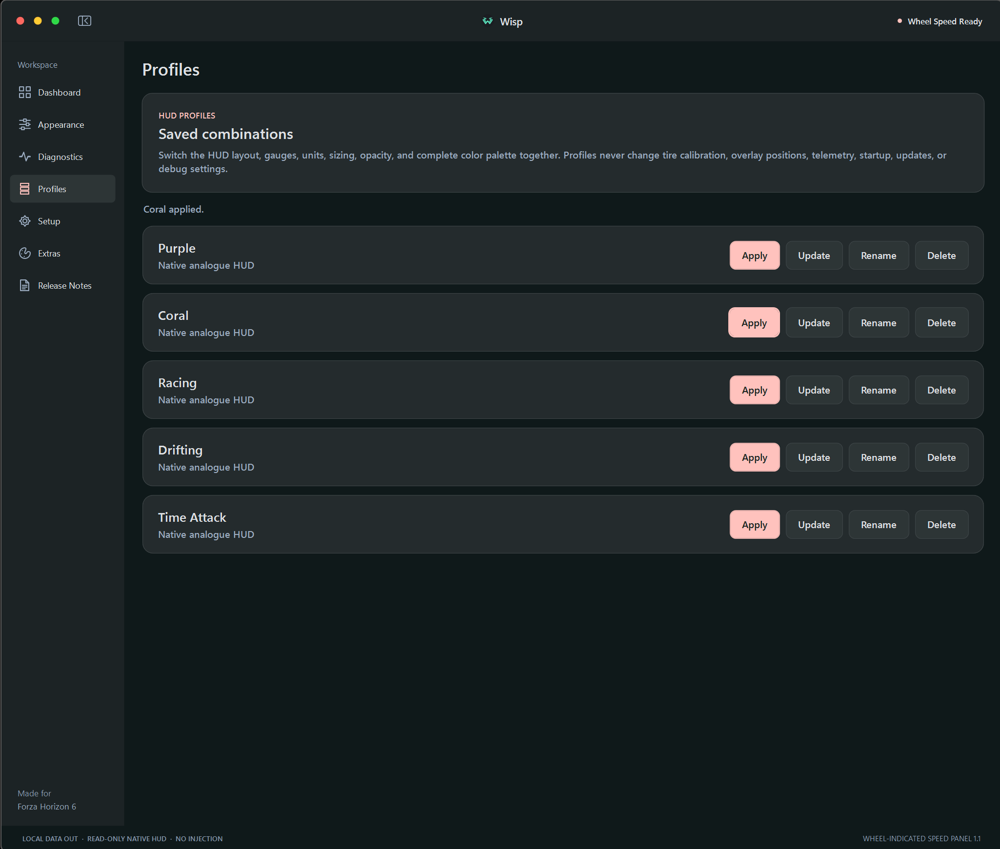
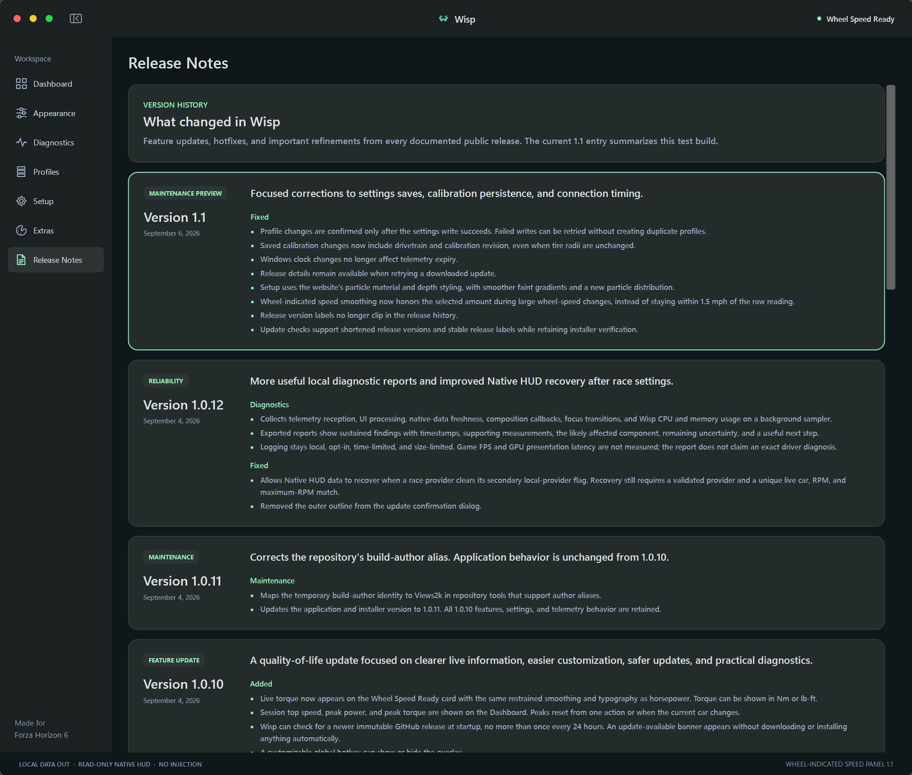

[](https://youtu.be/hoh169Sx_5I)

<p align="center">
  <strong>A wheel-indicated speed, boost, tire-temperature, and G-force companion for Forza Horizon 6.</strong><br>
  Supports Steam and Xbox app / Microsoft Store editions on Windows PC.<br><br>
  <a href="https://github.com/Views2k/Wisp/releases/latest"><strong>Download</strong></a> ·
  <a href="CHANGELOG.md">Changelog</a> ·
  <a href="docs/HOW-WISP-WAS-BUILT.md">Architecture</a>
</p>

## New in Wisp 1.2.1

If the Analogue tachometer lags or hitches, enable **CPU rendering** in
**Diagnostics**. Right-click Wisp's tray icon, choose **Exit Wisp**, then reopen
it to apply the change.

CPU mode reuses the unchanged dial background to reduce repeated drawing work,
while the needle and live readings continue updating.

GPU rendering remains the default. CPU mode can increase CPU usage; other
gauges keep their existing renderers. The gauge artwork, needle smoothing,
HUD settings, and Record and Compare Runs features are preserved.

[Download the latest version](https://github.com/Views2k/Wisp/releases/latest) ·
[1.2.1 release notes](docs/releases/Wisp-1.2.1-release-notes.md)

## Record and compare runs

Record a drive and compare it with another run without leaving Wisp. Start from
Dashboard or Runs, or set a recording shortcut. Add a countdown, choose a timed
stop, and mark moments while driving. Runs stay on your PC, with names, tune
labels and notes.

Open **Show graphs** to review speed, driver inputs, engine readings, G-force
and tire temperatures. Compare power and torque against RPM, inspect individual
readings, or select a section for its own statistics. Run A and Run B use
different colors and line styles in both Wisp and exported images.

Compare whole recordings or match an acceleration speed range. Findings explain
what the telemetry shows, with starting conditions and missing data called out.
Export a report image, raw CSV, or a Wisp run file that someone else can open.
Recordings are limited to ten minutes; Wisp does not identify tunes automatically
or record gameplay video.

[Download the latest version](https://github.com/Views2k/Wisp/releases/latest) ·
[1.2 release notes](docs/releases/Wisp-1.2.0-release-notes.md)

For earlier changes, see the [changelog](CHANGELOG.md) and
[release history](https://github.com/Views2k/Wisp/releases).



<p align="center"><sub>Wisp 1.1 Dashboard with live FH6 telemetry, torque, and session peaks.</sub></p>

Wisp shows the speed implied by the driven wheels rather than only the car's
ground speed. The difference becomes visible during wheelspin, burnouts,
drifting, lockup, and loss of grip.

FH6 Data Out supplies the local telemetry stream. Wisp learns the effective
rolling radius of the current tires, applies the correct driven-wheel model for
FWD, RWD, or AWD, and presents the result in a lightweight Windows overlay.

## Features

- Wheel-indicated speed with separate front and rear calibration for staggered
  AWD setups.
- Digital and Analogue Native HUD layouts for combustion and electric cars.
- A live boost gauge for confirmed turbocharged and supercharged cars. Digital
  mode adds a rail below the tachometer, while Analogue mode offers a 0 to 70 PSI
  or 0 to 5 bar dial.
- PSI or bar readouts, a learned per-car color scale, optional colored pressure
  numbers, attached or detached Analogue placement, a custom three-point gauge
  gradient, and an independent Digital option that uses the stock tachometer material.
- Front and rear tire-temperature gauges for both Native layouts. Digital mode
  uses two markers in one neutral rail with no colored fill, while Analogue mode
  uses two solid-color needles in one dial. Values support Fahrenheit and Celsius.
- Live RPM, gear, driver assists, electric power, regeneration, and redline
  state when the installed FH6 build supports those sources.
- Standalone or Native-attached G-force display with a longer motion trail.
- A vehicle dashboard for speed, RPM, drivetrain, power, torque, controls, and
  connection status.
- One continuous color editor for the application accent, background surfaces,
  HUD border, shared gauge gradient, and traction hook cue, plus named visual profiles.
- Local run recording, graphs, and comparisons, with report images, CSV, and
  shareable Wisp run files.
- Optional update discovery on every open and daily while running, a customizable
  HUD visibility shortcut, and bounded local debug logging with ZIP export for
  issue reports.

## Gallery

Wisp 1.1 with custom colors. The Release Notes capture shows the 1.1 preview entry.

<table>
  <tr>
    <td width="50%">
      
      <br><sub>Native Analogue HUD preview with attached boost and tire-temperature dials.</sub>
    </td>
    <td width="50%">
      
      <br><sub>Digital Native HUD with attached boost and front/rear tire-temperature rails.</sub>
    </td>
  </tr>
  <tr>
    <td width="50%">
      
      <br><sub>Analogue Native HUD with attached boost and dual-needle tire-temperature dials.</sub>
    </td>
    <td width="50%">
      
      <br><sub>Live telemetry, tire calibration, Native HUD capabilities, and local debug controls.</sub>
    </td>
  </tr>
  <tr>
    <td width="50%">
      
      <br><sub>Saved HUD profiles with their own layouts and colors.</sub>
    </td>
    <td width="50%">
      
      <br><sub>Release notes (1.1 preview).</sub>
    </td>
  </tr>
</table>

## Requirements

- Windows 10 or Windows 11, 64-bit.
- Forza Horizon 6 for Windows PC from Steam, the Xbox app, or Microsoft Store,
  with Data Out enabled.
- Borderless fullscreen, windowed, or another desktop-composited display mode.
  Exclusive fullscreen can cover ordinary Windows overlays.

Native process-derived HUD state supports Steam FH6 build `6.440.853.0` and
Xbox app / Microsoft Store PC build `3.440.853.0`. Previous bundled maps remain
available for installations that have not updated FH6. See
[Compatibility and Update Safety](docs/COMPATIBILITY.md#current-support) for the
complete bundled-build list and validation rules. Data Out reception and dashboard
calculations remain independent of those contracts. Wisp runs on Windows alongside
the game, not on Xbox consoles or a cloud-gaming session.

The installer is self-contained and installs for the current user. It does not
require administrator access or a separate .NET runtime.

## Install

1. Open [Releases](https://github.com/Views2k/Wisp/releases/latest).
2. Download and extract the current `Wisp-Setup-*.zip` package.
3. Keep the installer and its `.sha256` file together.
4. Verify the installer checksum, then run the installer.
5. Complete the required setup wizard on first launch.

**[WINDOWS POWERSHELL]**

```powershell
$installer = Get-ChildItem .\Wisp-Setup-*.exe | Select-Object -First 1
(Get-FileHash -LiteralPath $installer.FullName -Algorithm SHA256).Hash
```

Compare the result with the value in the adjacent `.sha256` file. The current
installer is unsigned, so Windows may show an unfamiliar-publisher warning.

## Application updates

Wisp checks for updates whenever it opens and every 24 hours while it remains
running, including while waiting in the tray.
Turn off **Automatically check on open and daily** in **Extras** to disable those checks.
You can also select **Check for updates** there to check immediately. Automatic
checks discover releases; they never download or install an update without your
confirmation.

An accepted release must be public, stable, and immutable. Numeric tags must
match the installer's normalized version, and GitHub must provide the installer's
exact byte length and SHA-256 digest. Downloads are limited to the canonical
GitHub release URL and GitHub's HTTPS release-asset hosts. Wisp shows the release
summary and asks you to confirm the download, installation, and restart. After
confirmation, it downloads the installer and verifies its length and digest
before starting installation. The separate
update helper repeats those checks, waits for Wisp to exit, runs the current-user
installer silently, validates the installed version, and then restarts Wisp.

The updater uses GitHub's anonymous release endpoint and contains no repository
credential. If GitHub's release API or artifact delivery is unavailable, the
check reports that the update service is unavailable. The installer remains
unsigned whether it is started manually or through Wisp.

A verified in-place update preserves a completed setup. A fresh installation
always opens the setup wizard before the dashboard or overlays are available.

## Connect FH6

In **Settings > HUD and Gameplay**:

1. Enable **Data Out**.
2. Set the IP address to `127.0.0.1`.
3. Set the port to `5500`, or to the listener port selected in Wisp.
4. Keep the car moving briefly while the setup wizard validates the stream.

The wizard also confirms the display mode and stock HUD setting before it opens
the dashboard or driving overlays.

## Speed sources

**Wheel-indicated** is the default. FH6 does not report tire size, so Wisp learns
effective rolling radius from clean, straight driving with grip. The value stays
unavailable until the current tire profile is trustworthy.

**FH6 speed** uses the packet's vehicle-speed value directly and does not require
tire learning. See [Wheel-Speed Model](docs/WHEEL-SPEED-MODEL.md) for the complete
calibration and drivetrain rules.

## Native HUD compatibility

Native HUD layouts start at FH6's bottom-right HUD position. Disable the stock
speedometer to avoid overlap, then use **Edit HUD layout** if a custom display
needs different placement or scale.

The Native provider opens the supported FH6 process with query/read
access only. It does not inject code, hook rendering, call game functions, or
write process memory. Changed or unknown game build identities disable the
affected process-derived state rather than reusing data from another build.

See [Compatibility and Update Safety](docs/COMPATIBILITY.md) for the supported
builds, validation boundary, and update behavior.

## Privacy and limitations

- Telemetry is accepted only from `127.0.0.1`.
- Settings and tire profiles remain in the current user's local application data.
- The installer is not code-signed.
- A changed FH6 build identity requires a reviewed compatibility map and may
  require an application update.
- FH6 exposes no tune identifier. Relearn the current tires after changing wheel
  or tire diameter.
- Software-only WPF captures do not reproduce the live Native HUD shaders.

## Build from source

Use a Git checkout and the .NET 8 SDK selected by `global.json`. Building the
native renderer also requires Visual Studio C++ build tools for x64 and a
Windows SDK containing `fxc.exe`; the application build compiles and copies
`Wisp.NativeRenderer.dll` automatically. Python 3.12 or later runs the offline
compatibility-audit tests; CI pins Python 3.14.7. Inno Setup 6 is needed only to
package an installer.

Review the [contribution and permission requirements](CONTRIBUTING.md) before
preparing changes. Installer packaging requires Git and a clean checkout;
a downloaded source ZIP is not sufficient. See [Validation](docs/VALIDATION.md)
for the packaging checks and [Shaders](docs/SHADERS.md) for rebuilding shader
bytecode after HLSL changes.

**[WINDOWS POWERSHELL]**

```powershell
dotnet restore Wisp.sln --locked-mode -p:NuGetAudit=true -p:NuGetAuditMode=all
dotnet format Wisp.sln --verify-no-changes --no-restore --verbosity minimal
dotnet test Wisp.sln --configuration Release --no-restore --nologo --disable-build-servers -m:1 -p:UseSharedCompilation=false
python -m unittest discover -s tools/tests -p "test_*.py" -v
```

To build the self-contained installer:

**[WINDOWS POWERSHELL]**

```powershell
.\installer\Build-Installer.ps1
```

## Documentation

- [Boost Gauge](docs/BOOST-GAUGE.md)
- [Tire Temperature](docs/TIRE-TEMPERATURE.md)
- [How Wisp Was Built](docs/HOW-WISP-WAS-BUILT.md)
- [Wheel-Speed Model](docs/WHEEL-SPEED-MODEL.md)
- [Compatibility and Update Safety](docs/COMPATIBILITY.md)
- [Validation](docs/VALIDATION.md)
- [Shader maintenance](docs/SHADERS.md)
- [Contributing](CONTRIBUTING.md)
- [Security Policy](SECURITY.md)

## License and game content

Wisp is proprietary, source-available software. Official unmodified binaries
may be used personally and non-commercially under the
[Wisp Proprietary Source License](LICENSE).

Forza Horizon 6 © Microsoft Corporation. Wisp is an unofficial community
project and is not endorsed by or affiliated with Microsoft.

The Native HUD content under `src/Wisp.App/Assets/Native` is based on publicly
circulated Forza Horizon 6 material. Views2k claims no ownership of Microsoft
Game Content. See [Third-party notices](THIRD-PARTY-NOTICES.md) and the
[Microsoft Game Content Usage Rules](https://www.xbox.com/en-us/developers/rules).
