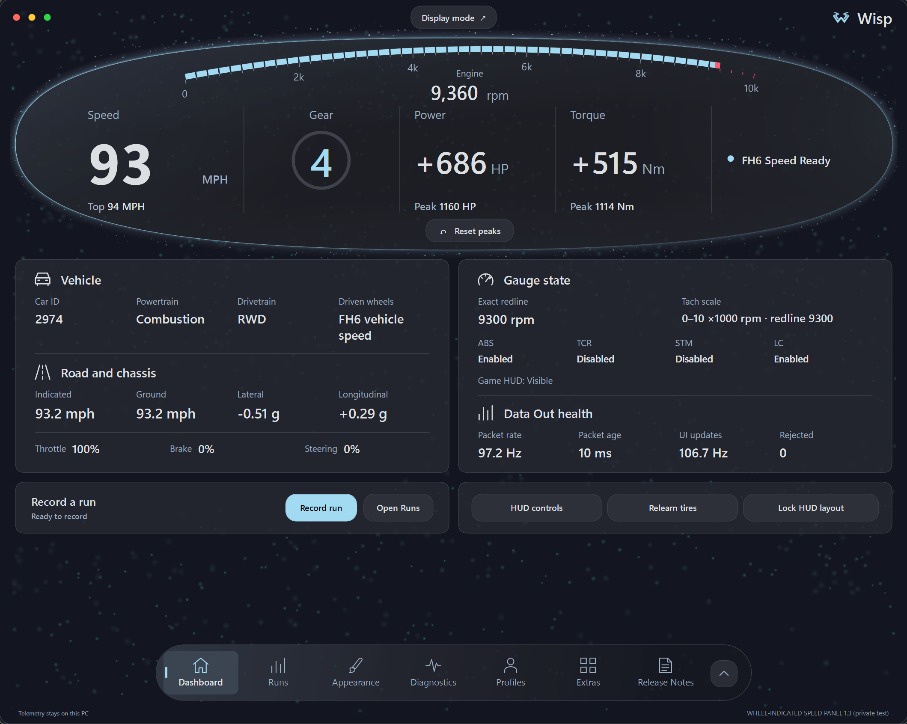
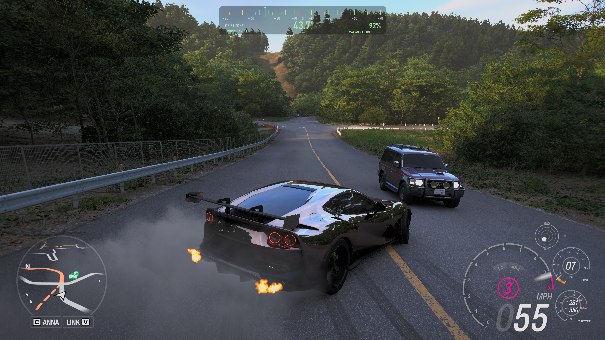
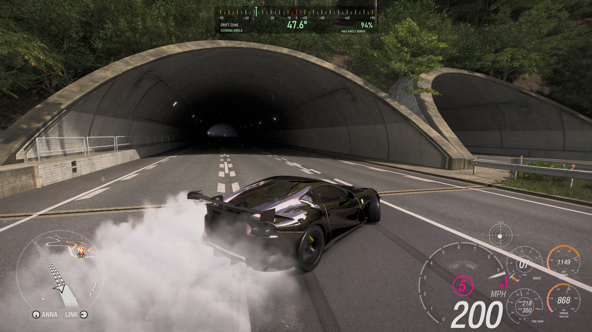
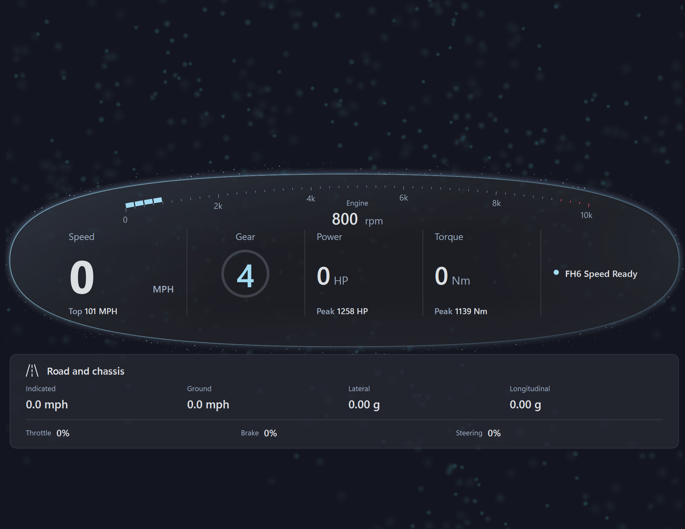
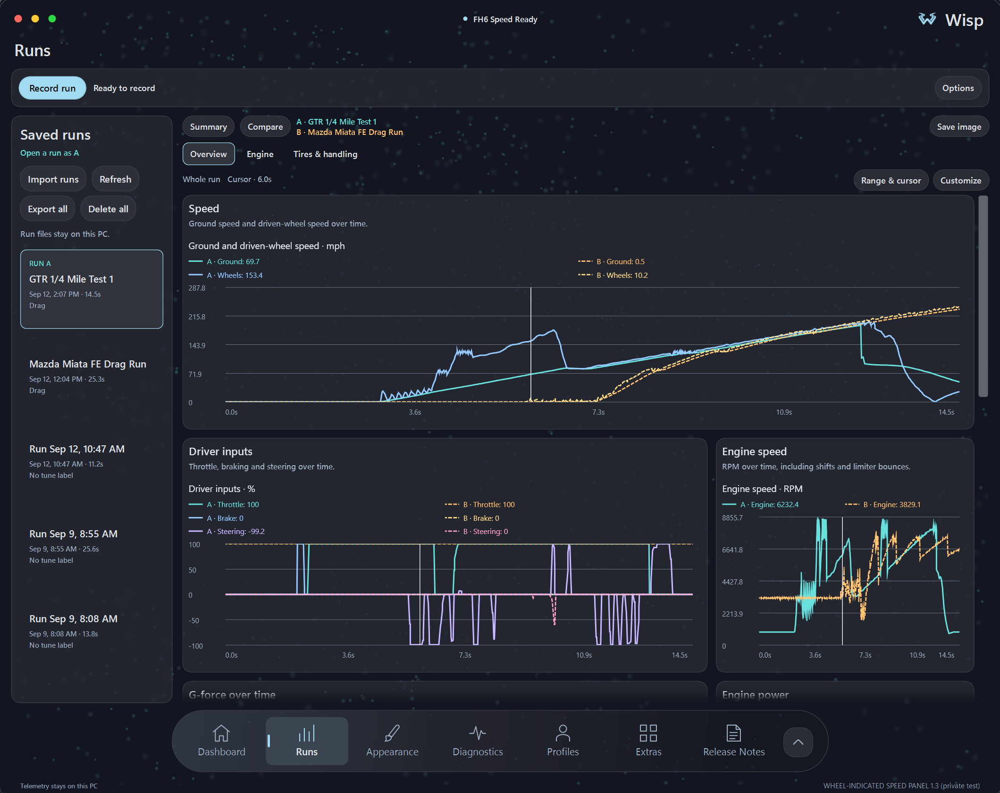
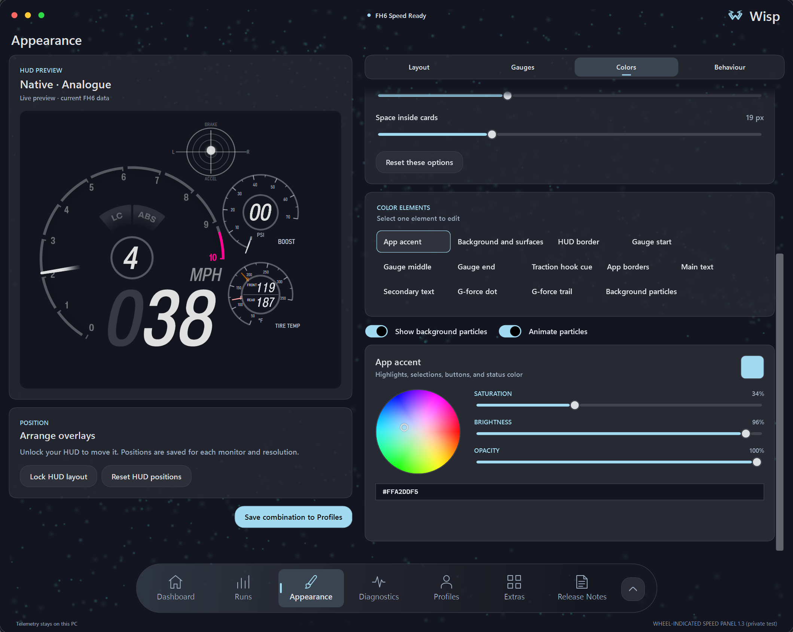
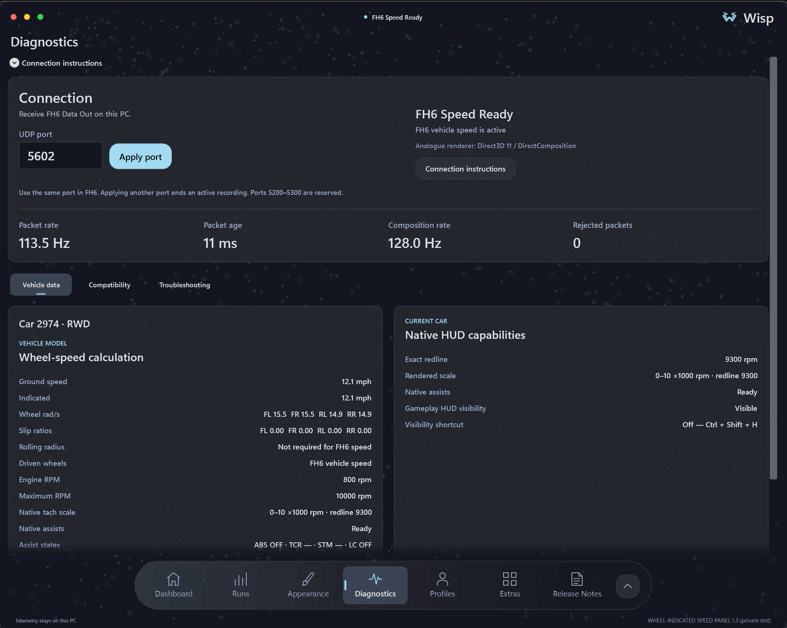
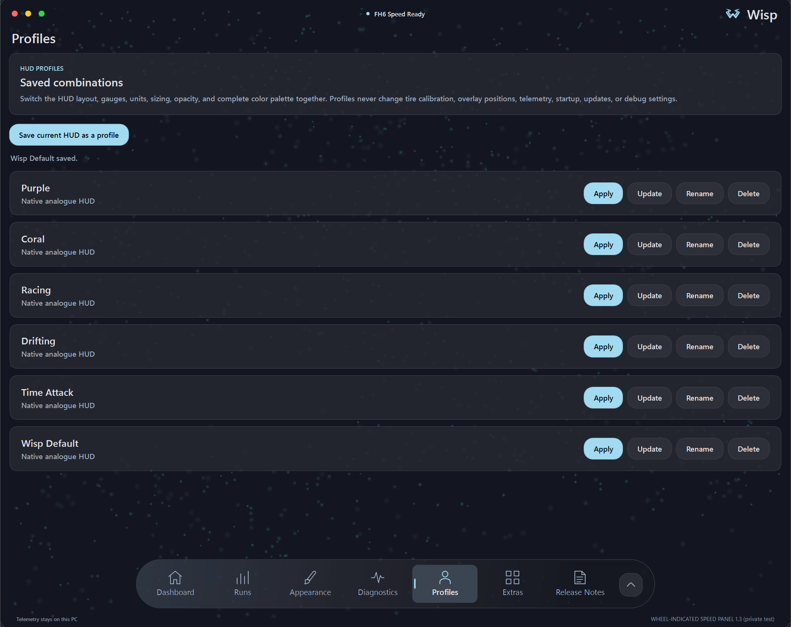
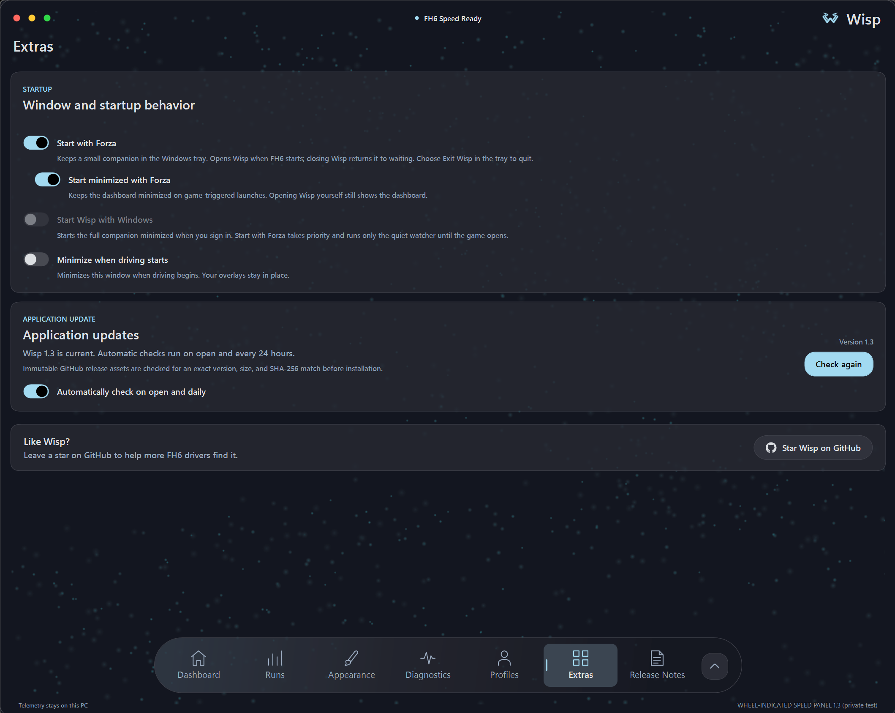

[](https://www.youtube.com/watch?v=RCR6KQ1_OlQ)

<p align="center">
  <strong>A customizable HUD, drift angle gauge, second-screen dashboard, and run analysis tool for Forza Horizon 6.</strong><br>
  Supports Steam and Xbox app / Microsoft Store editions on Windows PC.<br>
  <br><strong>Versions before 2.4 can show delayed or choppy tachometer motion on NVIDIA systems when G-SYNC/VRR is enabled. I recommend updating to 2.4.</strong>
  
  <a href="https://github.com/Views2k/Wisp/releases/download/v2.4.1/Wisp-Setup-2.4.1.zip"><strong>Download Wisp 2.4.1</strong></a> ·
  <a href="https://wispoverlay.com/">Website</a> ·
  <a href="CHANGELOG.md">Changelog</a> ·
  <a href="docs/HOW-WISP-WAS-BUILT.md">Architecture</a><br><br>
  Support Wisp: <a href="https://ko-fi.com/views2k">Ko-fi</a> ·
  <a href="https://buymeacoffee.com/Views2k">Buy Me a Coffee</a>
</p>

## Wisp 2.4.1

Fixes Drift Zone angle-bonus guidance showing **UNVERIFIED BUILD** on Xbox app / Microsoft Store FH6 3.440.853.0 on Windows PC. [Release notes](docs/releases/Wisp-2.4.1-release-notes.md).

## Wisp 2.4 performance hotfix

Wisp 2.4 improves analogue needle motion with G-SYNC while Forza has focus. When the main HUD fits on one monitor, it uses a monitor-sized native window. The overlay requests passive composition updates, and needle animation receives telemetry independently of the interface. The update also fixes queued playback, readiness checks, and worker waits, and reuses render command storage and unchanged needle pixels.

[Read the investigation, fixes, troubleshooting and credits](docs/releases/Wisp-2.4.0-release-notes.md). Thanks to [fredemmott for sharing Microsoft's Direct3D-team guidance](https://github.com/OpenKneeboard/OpenKneeboard/issues/677#issuecomment-3250237599) on transparent overlays and variable refresh rate.

### Included from Wisp 2.3.4

Changing the app accent color on another tab no longer crashes Wisp. The dashboard oval returns in the selected color when you switch back. Supplementary gauges stay separate in digital layouts. If an update cannot start, Wisp stays open and shows repair instructions.

**Shift guidance is beta and off by default.** Calibrate each supported combustion car and tune with a rolling full-throttle pull and a confirming upshift. Green, yellow and flashing red stages show the approach to a calibrated RPM target. The beta supports combustion cars on Steam FH6 build **6.440.853.0**.

The boost and tire-temperature Appearance preview fixes from 2.3.2 are included.

### Included from Wisp 2.3

**Drift mode** holds the power and torque numbers and needles through brief
combustion-engine power cuts. The numbers pulse in a color you choose, with a
**Flash frequency** slider from **0.5 to 3 Hz**. The default is **1.25 Hz**.

Enable it in **Appearance > Gauges > Engine output > More options** and choose
**Drift cut flash** under **Appearance > Colors**. Drift mode is off by default;
its settings save with HUD profiles. Recorded telemetry and peak readings keep
their original values.

[Read the Wisp 2.3.4 hotfix release notes](docs/releases/Wisp-2.3.4-release-notes.md).

The shared native renderer, smaller attached EV gauges, and Appearance preview
fixes from [Wisp 2.2](docs/releases/Wisp-2.2.0-release-notes.md) are included.

### Gauge sizing from 2.1.1

The four supplementary combustion analogue dials match at 100% and stay aligned when resized.
Power and torque have separate size sliders, boost and tire sizing works while
attached, and a **50–200% G-force meter size** control applies across attached,
detached, and Combined layouts. Previews follow these settings, including saved
gauge sizes and positions.

Wisp 2.1 introduced the power and torque gauges described below.

[Power & torque](#power-and-torque-gauges) · [Dashboard](#dashboard-and-interface) · [Drift gauge](#drift-angle-guidance) ·
[Runs](#a-more-useful-runs-workspace) · [Appearance](#make-the-interface-yours) ·
[Gallery](#gallery) · [Install](#install)

### Power and torque gauges

See live **BHP** and **torque** beside the speedometer, with native-style dials,
needles, peak markers, and peak readouts. Turn either gauge on or off in
**Appearance > Gauges > Engine output**. Attach each one to the speedometer,
or detach it and use **Edit HUD layout** to place it separately. Torque follows
your **Nm** or **lb-ft** preference. [See the gauges in gameplay](#gallery).

Use the separate **Power gauge size** and **Torque gauge size** sliders to resize
each dial. Under **More options**, adjust smoothing and a fixed range for each
car. **Set from this run** uses the peaks Wisp has observed plus 10%; the scale
then stays fixed while driving. After retuning, reset the peaks and make another
pull before setting the range again.

The **Gauge start**, **Gauge middle**, and **Gauge end** colors apply across boost,
tire temperature, power, and torque. Optional colored numbers follow the same
palette. Smoothing defaults to **250 ms**; negative output is hidden unless you
enable **Show negative power and torque**. Recorded telemetry retains its original values.

Fresh installations start with **Native Analogue** and all gauges enabled, with
matching sizes for the four supplementary dials. Updates preserve existing
settings, profiles, tire calibration, and saved runs.

[Read the Wisp 2.1 release notes](docs/releases/Wisp-2.1.0-release-notes.md).

## Dashboard and interface

The dashboard shows a curved tachometer, large speed
and gear readings, and live power and torque. Use **Display mode** as a borderless
dashboard on a second monitor. Fill the screen or resize it to share the monitor
with something else. Press **F11** from Dashboard to switch modes, or **Esc** to leave.
Driver assists distinguish **Disabled**, **Enabled**, and **Active**.



### Drift angle guidance

Add a drift gauge to see your angle and the share of the
Drift Zone angle bonus you are using. The scoring-angle range starts
at **10°** and the angle bonus reaches its ceiling at **59.4°**. A **20–40°** drift
already corresponds to roughly **80–90%** of that maximum angle bonus. Balance
your angle with speed and line while the game is awarding points.


Choose the guidance in **Appearance > Gauges**. Adjust its size and position,
enable dark shading for bright skies, or add a black background with adjustable
opacity. The gauge keeps its ticks and readings without an outer frame.
Below **5 mph ground speed** (about **8 km/h**), it hides the angle, marker, and
bonus so a stationary car on a slope or spinning its wheels does not show
misleading drift guidance.



<a id="a-more-useful-runs-workspace"></a>

### Record and compare runs

Record a drive from Dashboard or Runs, or use a recording shortcut. Set a
countdown or timed stop, mark moments while driving, then add a name, tune label,
and notes. Recordings stay on your PC and can last up to ten minutes.

Search saved runs by name or tune label. Names, tune labels, and notes save
automatically, with a **Saving… / Saved** indicator. Switching runs keeps
your pending edits; if saving fails, **Retry** lets you try again.

Select **Show graphs** to open the workspace. **Overview**, **Engine**, and
**Tires & handling** group related measurements. Show or hide graphs, reorder
them, and choose their width. Review statistics as cards or a table. A shared
cursor and selectable time range make it easier to inspect the same moment
across speed, inputs, RPM, power, torque, boost, G-force, and tire temperatures.

Compare two runs overlaid or side by side, with distinct colors and line styles.
Match an acceleration speed range, inspect power and torque against RPM, or
compare tire heat and cornering load. Summaries explain the measured differences
and call out gaps or different starting conditions.

Use **Import runs** for individual `.wisprun` files or a Wisp library ZIP.
**Export all** backs up the library, and **Delete all** has confirmation and Undo.
Use the **Export** menu for a shareable run file or raw CSV, and **Save image**
for a graph report. Imports skip identical runs and reject conflicting duplicates
without overwriting existing data.

<a id="make-the-interface-yours"></a>

### Appearance

Appearance groups **Layout**, **Gauges**, **Colors**, and **Behaviour** beside
the live HUD preview. Set your accent, backgrounds, text, borders, glow,
surface opacity, corner rounding, and spacing. G-force dot and trail colors are
independent, and the G-force meter can be disabled in every layout.

Optional background particles follow your accent or a separate color. Pause or
hide them at any time. The dashboard adds accent lighting and particles along
its rim. Fresh installations use the setup wizard's palette; updates retain your
colors and saved data. Prefer the previous interface? Enable **Use legacy
interface** in **Appearance > Layout**, then restart Wisp.

Common settings stay visible, with detailed adjustments under **More options**.
Click the connection status to check game detection, incoming telemetry, and
HUD visibility. The panel includes help for the current connection state.

An optional quick tour introduces the drift gauge, Display mode, Runs, and
Appearance. Start from the welcome banner or choose **Replay the quick tour**
in Release Notes.

[Download Wisp 2.4.1](https://github.com/Views2k/Wisp/releases/download/v2.4.1/Wisp-Setup-2.4.1.zip) ·
[2.4 release notes](docs/releases/Wisp-2.4.0-release-notes.md) ·
[Changelog](CHANGELOG.md)

Interface screenshots show the build used to develop Wisp 2.0. Their original
version labels are retained; the gameplay gallery also shows the new 2.1 gauges.

## Wheel-indicated speed

Wisp shows the speed implied by the driven wheels rather than only the car's
ground speed. The difference becomes visible during wheelspin, burnouts,
drifting, lockup, and loss of grip.

FH6 Data Out supplies the local telemetry stream. Wisp learns the effective
rolling radius of the current tires and calculates speed from the driven wheels
for FWD, RWD, or AWD. The result appears in the Windows overlay.

## Features

- Wheel-indicated speed with separate front and rear calibration for staggered
  AWD setups.
- Digital and Analogue Native HUD layouts for combustion and electric cars.
- A live boost gauge for confirmed turbocharged and supercharged cars. Digital
  mode adds a rail below the tachometer, while Analogue mode offers a 0 to 70 PSI
  or 0 to 5 bar dial.
- PSI or bar readouts, a learned per-car color scale, optional colored pressure
  numbers, attached or detached Analogue placement, a custom three-point gauge
  gradient, and an independent Digital option that uses the stock tachometer material.
- Front and rear tire-temperature gauges for both Native layouts. Digital mode
  uses two markers in one neutral rail with no colored fill, while Analogue mode
  uses two solid-color needles in one dial. Values support Fahrenheit and Celsius.
- Separate power and torque dials with live BHP, Nm or lb-ft,
  peak markers, attached or detached placement, adjustable smoothing, and fixed
  ranges saved per car.
- Live RPM, gear, driver assists, electric power, regeneration, and redline
  state when the installed FH6 build supports those sources.
- Standalone or Native-attached G-force display with a longer motion trail.
- A borderless second-screen dashboard with a resizable Display mode.
- Drift angle and angle-bonus guidance, or a custom target and tolerance.
- Application styling, individual G-force dot and trail colors, and saved HUD
  profiles for layouts and gauge colors.
- Local run recording, configurable graphs, overlaid or side-by-side comparisons,
  report images, CSV, shareable run files, and whole-library backup and import.
- Optional update checks whenever Wisp opens and daily while running, a
  customizable HUD visibility shortcut, and local debug logging with storage
  limits and ZIP export for issue reports.

## Gallery

Actual Wisp captures with custom colors. Click the 2.1 gameplay image to inspect
the original-resolution HUD. The 2.0 interface captures retain their prerelease
version labels.

<table>
  <tr>
    <td colspan="2">
      <a href="docs/images/wisp-2.1-power-torque-gameplay.webp"></a>
      <br><sub>Wisp 2.1: live power and torque alongside the Native Analogue speedometer and Drift Zone angle gauge.</sub>
    </td>
  </tr>
  <tr>
    <td width="50%">
      
      <br><sub>Display mode for a dedicated screen or a resizable part of your second monitor.</sub>
    </td>
    <td width="50%">
      
      <br><sub>Configurable graphs and comparisons, with a separate color for each run.</sub>
    </td>
  </tr>
  <tr>
    <td width="50%">
      
      <br><sub>Live HUD preview, gauge controls, colors, and application styling.</sub>
    </td>
    <td width="50%">
      
      <br><sub>Live telemetry, tire calibration, Native HUD capabilities, and local debug controls.</sub>
    </td>
  </tr>
  <tr>
    <td width="50%">
      
      <br><sub>Saved HUD profiles with their own layouts and colors.</sub>
    </td>
    <td width="50%">
      
      <br><sub>Startup behavior and application updates.</sub>
    </td>
  </tr>
</table>

## HUD rendering

To try software rendering for the live HUD, enable **CPU rendering** in
**Diagnostics**. Right-click Wisp's tray icon, choose **Exit Wisp**, then reopen
it to apply the change. CPU mode reuses unchanged dial-background pixels while
the needle and live readings continue updating.

GPU rendering remains the default. CPU mode can increase CPU usage, and Windows
still uses the GPU to compose the overlay. Live HUD gauges share the native
renderer; Appearance previews and the fallback retain WPF rendering.

## Requirements

- Windows 10 or Windows 11, 64-bit.
- Forza Horizon 6 for Windows PC from Steam, the Xbox app, or Microsoft Store,
  with Data Out enabled.
- Set Forza Horizon 6's display mode to **Fullscreen**.

Native process-derived HUD state supports Steam FH6 build `6.440.853.0` and
Xbox app / Microsoft Store PC build `3.440.853.0`. Previous bundled maps remain
available for installations that have not updated FH6. See
[Compatibility and Update Safety](docs/COMPATIBILITY.md#current-support) for the
complete bundled-build list and validation rules. Data Out reception and dashboard
calculations remain independent of those contracts. Wisp runs alongside a local
Windows PC installation of the game.

The installer is self-contained and installs for the current user. It does not
require administrator access or a separate .NET runtime.

## Install

1. Open the [Wisp 2.4.1 release](https://github.com/Views2k/Wisp/releases/tag/v2.4.1).
2. Download and extract [Wisp-Setup-2.4.1.zip](https://github.com/Views2k/Wisp/releases/download/v2.4.1/Wisp-Setup-2.4.1.zip).
3. Keep the installer and its `.sha256` file together.
4. Verify the installer checksum, then run the installer.
5. Complete the required setup wizard on first launch.

**[WINDOWS POWERSHELL]**

```powershell
$installer = Get-ChildItem .\Wisp-Setup-*.exe | Select-Object -First 1
(Get-FileHash -LiteralPath $installer.FullName -Algorithm SHA256).Hash
```

Compare the result with the value in the adjacent `.sha256` file. The current
installer is unsigned, so Windows may show an unfamiliar-publisher warning.

## Application updates

Wisp checks for updates whenever it opens and every 24 hours while it remains
running, including while waiting in the tray.
Turn off **Automatically check on open and daily** in **Extras** to disable those checks.
You can also select **Check for updates** there to check immediately. Automatic
checks discover releases; they never download or install an update without your
confirmation.

An accepted release must be public, stable, and immutable. Numeric tags must
match the installer's normalized version, and GitHub must provide the installer's
exact byte length and SHA-256 digest. Downloads are limited to the canonical
GitHub release URL and GitHub's HTTPS release-asset hosts. Wisp shows the release
summary and asks you to confirm the download, installation, and restart. After
confirmation, it downloads the installer and verifies its length and digest
before starting installation. The separate
update helper repeats those checks, waits for Wisp to exit, runs the current-user
installer silently, validates the installed version, and then restarts Wisp.

The updater uses GitHub's anonymous release endpoint and contains no repository
credential. If GitHub's release API or artifact delivery is unavailable, the
check reports that the update service is unavailable. The installer remains
unsigned whether it is started manually or through Wisp.

A verified in-place update preserves a completed setup. A fresh installation
always opens the setup wizard before the dashboard or overlays are available.

## Connect FH6

In **Settings > HUD and Gameplay**:

1. Enable **Data Out**.
2. Set the IP address to `127.0.0.1`.
3. Set the port to `5500`, or to the listener port selected in Wisp.
4. Keep the car moving briefly while the setup wizard validates the stream.

The wizard also confirms the display mode and stock HUD setting before it opens
the dashboard or driving overlays.

## Speed sources

**Wheel-indicated** is the default. Wisp learns effective rolling radius from
clean, straight driving with grip, then enables wheel-indicated speed once the
current tire profile passes calibration.

**FH6 speed** uses the packet's vehicle-speed value directly.
See [Wheel-Speed Model](docs/WHEEL-SPEED-MODEL.md) for the complete
calibration and drivetrain rules.

## Native HUD compatibility

Native HUD layouts start at FH6's bottom-right HUD position. Disable the stock
speedometer to avoid overlap, then use **Edit HUD layout** if a custom display
needs different placement or scale.

The Native provider opens the supported FH6 process with query/read
access only. It does not inject code, hook rendering, call game functions, or
write process memory. Changed or unknown game build identities disable the
affected process-derived state rather than reusing data from another build.

See [Compatibility and Update Safety](docs/COMPATIBILITY.md) for the supported
builds, validation boundary, and update behavior.

<a id="privacy-and-limitations"></a>

## Privacy and compatibility

- Telemetry is accepted only from `127.0.0.1`.
- Settings and tire profiles remain in the current user's local application data.
- The installer is not code-signed.
- A changed FH6 build identity requires a reviewed compatibility map and may
  require an application update.
- Relearn the current tires after changing wheel or tire diameter.

## Build from source

Use a Git checkout and the .NET 8 SDK selected by `global.json`. Building the
native renderer also requires Visual Studio C++ build tools for x64 and a
Windows SDK containing `fxc.exe`; the application build compiles and copies
`Wisp.NativeRenderer.dll` automatically. Python 3.12 or later runs the offline
compatibility-audit tests; CI pins Python 3.14.7. Inno Setup 6 is needed only to
package an installer.

Review the [contribution and permission requirements](CONTRIBUTING.md) before
preparing changes. Installer packaging requires Git and a clean checkout;
a downloaded source ZIP is not sufficient. See [Validation](docs/VALIDATION.md)
for the packaging checks and [Shaders](docs/SHADERS.md) for rebuilding shader
bytecode after HLSL changes.

**[WINDOWS POWERSHELL]**

```powershell
dotnet restore Wisp.sln --locked-mode -p:NuGetAudit=true -p:NuGetAuditMode=all
dotnet format Wisp.sln --verify-no-changes --no-restore --verbosity minimal
dotnet test Wisp.sln --configuration Release --no-restore --nologo --disable-build-servers -m:1 -p:UseSharedCompilation=false
python -m unittest discover -s tools/tests -p "test_*.py" -v
```

To build the self-contained installer:

**[WINDOWS POWERSHELL]**

```powershell
.\installer\Build-Installer.ps1
```

## Documentation

- [Boost Gauge](docs/BOOST-GAUGE.md)
- [Tire Temperature](docs/TIRE-TEMPERATURE.md)
- [Run files and library archives](docs/run-library-format.md)
- [Wisp 2.4 release notes](docs/releases/Wisp-2.4.0-release-notes.md)
- [Wisp 2.3.4 release notes](docs/releases/Wisp-2.3.4-release-notes.md)
- [Wisp 2.3.2 release notes](docs/releases/Wisp-2.3.2-release-notes.md)
- [Wisp 2.2 release notes](docs/releases/Wisp-2.2.0-release-notes.md)
- [Wisp 2.1.1 release notes](docs/releases/Wisp-2.1.1-release-notes.md)
- [Wisp 2.1 release notes](docs/releases/Wisp-2.1.0-release-notes.md)
- [Wisp 2.0 release notes](docs/releases/Wisp-2.0.0-release-notes.md)
- [How Wisp Was Built](docs/HOW-WISP-WAS-BUILT.md)
- [Wheel-Speed Model](docs/WHEEL-SPEED-MODEL.md)
- [Compatibility and Update Safety](docs/COMPATIBILITY.md)
- [Validation](docs/VALIDATION.md)
- [Shader maintenance](docs/SHADERS.md)
- [Contributing](CONTRIBUTING.md)
- [Security Policy](SECURITY.md)

## License and game content

Wisp is proprietary, source-available software. Official unmodified binaries
may be used personally and non-commercially under the
[Wisp Proprietary Source License](LICENSE).

Forza Horizon 6 © Microsoft Corporation. Wisp is an unofficial community
project and is not endorsed by or affiliated with Microsoft.

The Native HUD content under `src/Wisp.App/Assets/Native` is based on publicly
circulated Forza Horizon 6 material. I claim no ownership of Microsoft
Game Content. See [Third-party notices](THIRD-PARTY-NOTICES.md) and the
[Microsoft Game Content Usage Rules](https://www.xbox.com/en-us/developers/rules).
