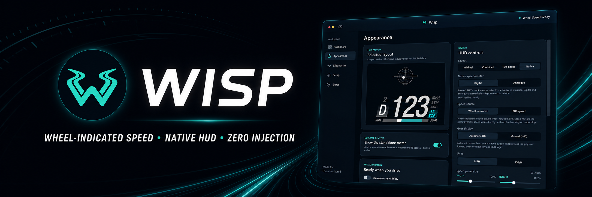
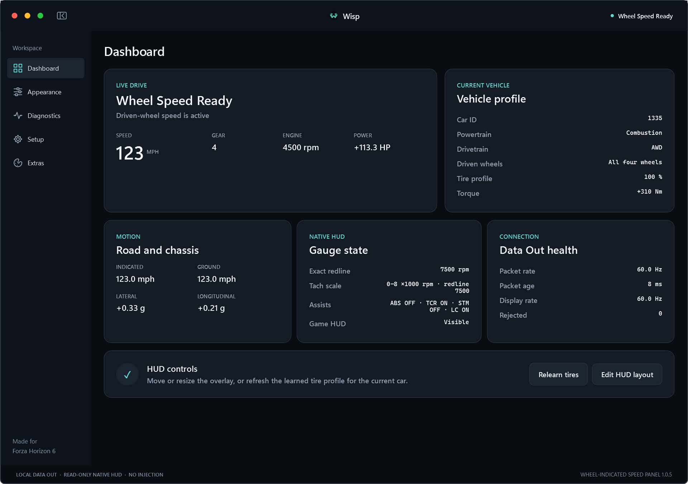
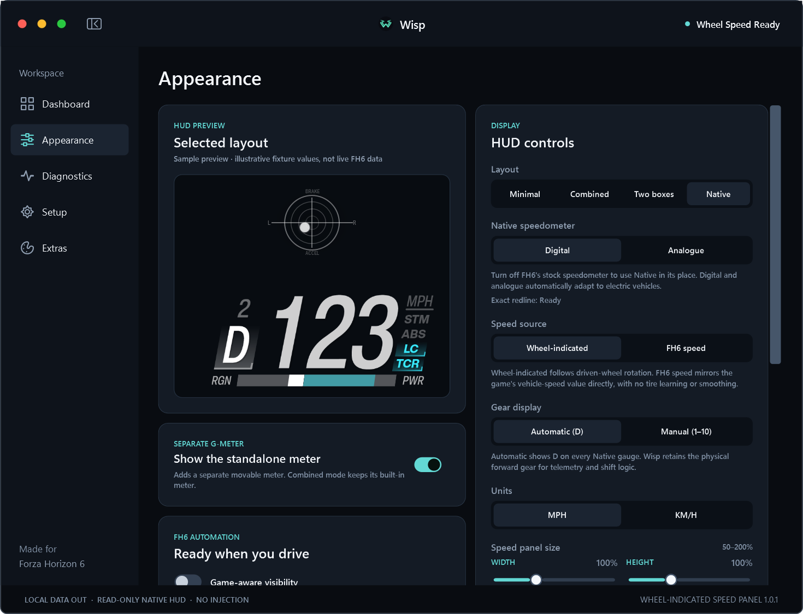
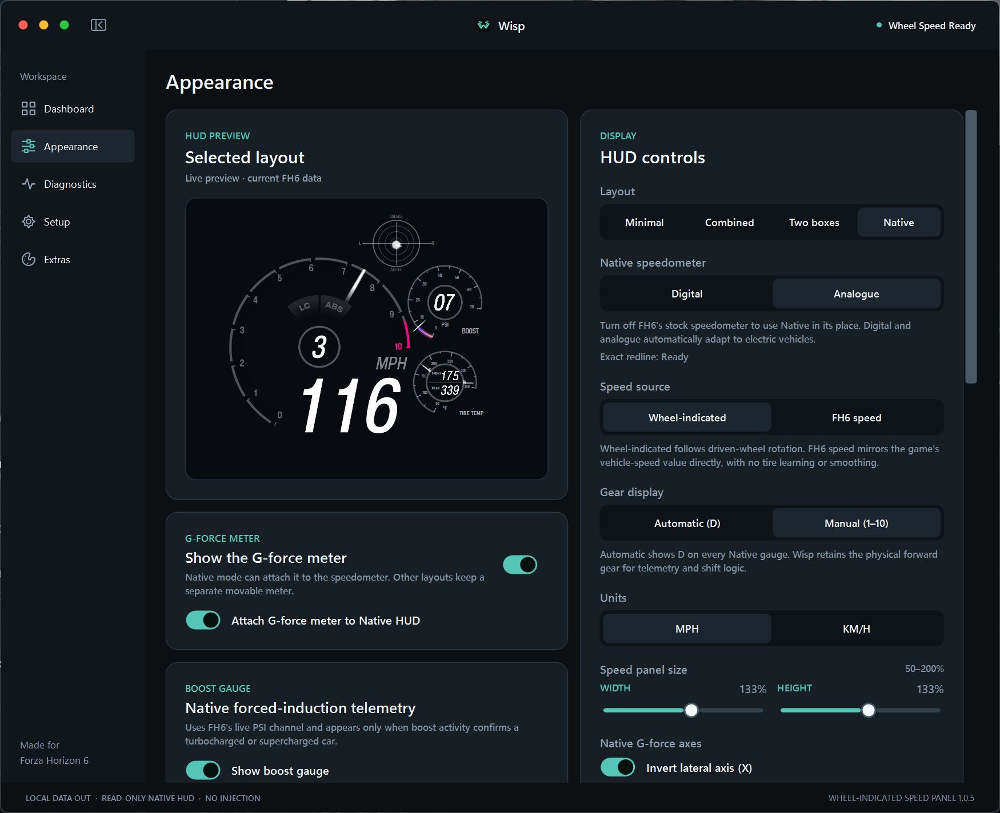
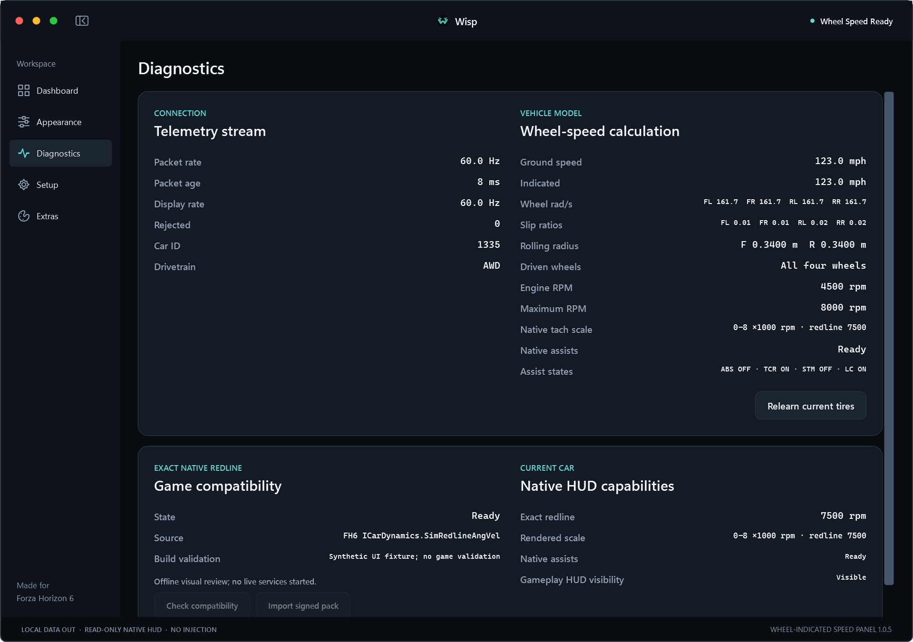
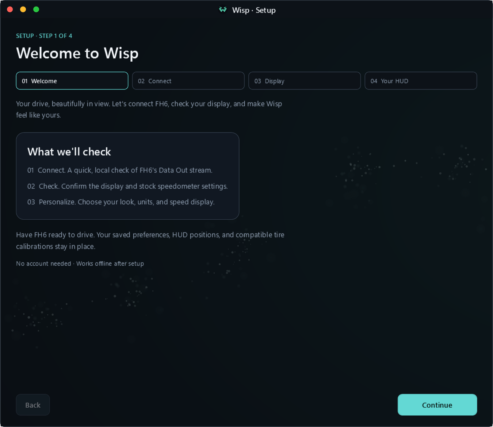

<p align="center">
  <strong>A wheel-indicated speed and G-force companion for Forza Horizon 6.</strong><br><br>
  <a href="https://github.com/Views2k/Wisp/releases/latest"><strong>Download</strong></a> ·
  <a href="CHANGELOG.md">Changelog</a> ·
  <a href="docs/HOW-WISP-WAS-BUILT.md">Architecture</a>
</p>



<p align="center"><sub>Dashboard shown with deterministic sample telemetry.</sub></p>

Wisp shows the speed implied by the driven wheels rather than only the car's
ground speed. The difference becomes visible during wheelspin, burnouts,
drifting, lockup, and loss of grip.

FH6 Data Out supplies the local telemetry stream. Wisp learns the effective
rolling radius of the current tires, applies the correct driven-wheel model for
FWD, RWD, or AWD, and presents the result in a lightweight Windows overlay.

## Features

- Wheel-indicated speed with separate front and rear calibration for staggered
  AWD setups.
- Digital and Analogue Native HUD layouts for combustion and electric cars.
- Live RPM, gear, driver assists, electric power, regeneration, and redline
  state when the installed FH6 build supports those sources.
- Standalone or integrated G-force display.
- A vehicle dashboard for speed, RPM, drivetrain, power, torque, controls, and
  connection status.
- Game-aware overlay visibility for driving, menus, loading screens, cutscenes,
  and alt-tab.
- Fifteen palettes that can be selected independently for the application
  accent, dark background, and HUD border.
- No account, analytics, or driving-telemetry upload. External Internet access
  occurs only when the user selects **Check for updates**; compatibility-contract
  networking is disabled in the current build.

## Gallery

<table>
  <tr>
    <td width="50%">
      
      <br><sub>Electric Native HUD preview with deterministic sample values.</sub>
    </td>
    <td width="50%">
      
      <br><sub>Accent, background, and HUD border palettes are selected independently.</sub>
    </td>
  </tr>
  <tr>
    <td width="50%">
      
      <br><sub>Diagnostics populated with deterministic telemetry and Native HUD capability data.</sub>
    </td>
    <td width="50%">
      
      <br><sub>The required setup checks Data Out, display settings, and HUD preferences.</sub>
    </td>
  </tr>
</table>

## Requirements

- Windows 10 or Windows 11, 64-bit.
- Forza Horizon 6 with Data Out enabled.
- Borderless fullscreen, windowed, or another desktop-composited display mode.
  Exclusive fullscreen can cover ordinary Windows overlays.

Native process-derived HUD state currently supports the recorded Steam FH6
build `6.430.771.0` and its exact executable fingerprint. Data Out reception and
dashboard calculations remain independent of that compatibility contract.

The installer is self-contained and installs for the current user. It does not
require administrator access or a separate .NET runtime.

## Install

1. Open [Releases](https://github.com/Views2k/Wisp/releases/latest).
2. Download and extract the current `Wisp-Setup-*.zip` package.
3. Keep the installer and its `.sha256` file together.
4. Verify the installer checksum, then run the installer.
5. Complete the required setup wizard on first launch.

**[WINDOWS POWERSHELL]**

```powershell
$installer = Get-ChildItem .\Wisp-Setup-*.exe | Select-Object -First 1
(Get-FileHash -LiteralPath $installer.FullName -Algorithm SHA256).Hash
```

Compare the result with the value in the adjacent `.sha256` file. The current
installer is unsigned, so Windows may show an unfamiliar-publisher warning.

## Application updates

Application updates are manual. Open **Extras** and select **Check for updates**
when you want Wisp to query the latest GitHub Release. Wisp does not check in
the background.

An accepted release must be public, stable, and immutable. Its tag and
versioned installer name must match, and GitHub must provide the installer's
exact byte length and SHA-256 digest. Downloads are limited to the canonical
GitHub release URL and GitHub's HTTPS release-asset hosts. Wisp verifies the
length and digest before asking whether to install and restart. The separate
update helper repeats those checks, waits for Wisp to exit, runs the current-user
installer silently, validates the installed version, and then restarts Wisp.

The updater uses GitHub's anonymous release endpoint and contains no repository
credential. If GitHub's release API or artifact delivery is unavailable, the
check reports that the update service is unavailable. The installer remains
unsigned whether it is started manually or through Wisp.

A verified in-place update preserves a completed setup. A fresh installation
always opens the setup wizard before the dashboard or overlays are available.

## Connect FH6

In **Settings > HUD and Gameplay**:

1. Enable **Data Out**.
2. Set the IP address to `127.0.0.1`.
3. Set the port to `5500`, or to the listener port selected in Wisp.
4. Keep the car moving briefly while the setup wizard validates the stream.

The wizard also confirms the display mode and stock HUD setting before it opens
the dashboard or driving overlays.

## Speed sources

**Wheel-indicated** is the default. FH6 does not report tire size, so Wisp learns
effective rolling radius from clean, straight driving with grip. The value stays
unavailable until the current tire profile is trustworthy.

**FH6 speed** uses the packet's vehicle-speed value directly and does not require
tire learning. See [Wheel-Speed Model](docs/WHEEL-SPEED-MODEL.md) for the complete
calibration and drivetrain rules.

## Native HUD compatibility

Native HUD layouts start at FH6's bottom-right HUD position. Disable the stock
speedometer to avoid overlap, then use **Edit HUD layout** if a custom display
needs different placement or scale.

The Native provider opens the supported FH6 process with query/read
access only. It does not inject code, hook rendering, call game functions, or
write process memory. Changed or unknown executable fingerprints disable the
affected process-derived state rather than reusing data from another build.

See [Compatibility and Update Safety](docs/COMPATIBILITY.md) for the supported
build, validation boundary, and update behavior.

## Privacy and limitations

- Telemetry is accepted only from `127.0.0.1`.
- Settings and tire profiles remain in the current user's local application data.
- The installer is not code-signed.
- A changed FH6 executable fingerprint requires a reviewed Wisp update.
- FH6 exposes no tune identifier. Relearn the current tires after changing wheel
  or tire diameter.
- Software-only WPF captures do not reproduce the live Native HUD shaders.

## Build from source

The repository uses the .NET 8 SDK selected by `global.json`. Python 3.12 or
later runs the offline compatibility-audit tests; CI pins Python 3.14.7. Inno
Setup 6 is needed only to package an installer.

**[WINDOWS POWERSHELL]**

```powershell
dotnet restore Wisp.sln --locked-mode -p:NuGetAudit=true -p:NuGetAuditMode=all
dotnet format Wisp.sln --verify-no-changes --no-restore --verbosity minimal
dotnet test Wisp.sln --configuration Release --no-restore --nologo --disable-build-servers -m:1 -p:UseSharedCompilation=false
python -m unittest discover -s tools/tests -p "test_*.py" -v
```

To build the self-contained installer:

**[WINDOWS POWERSHELL]**

```powershell
.\installer\Build-Installer.ps1
```

## Documentation

- [How Wisp Was Built](docs/HOW-WISP-WAS-BUILT.md)
- [Wheel-Speed Model](docs/WHEEL-SPEED-MODEL.md)
- [Compatibility and Update Safety](docs/COMPATIBILITY.md)
- [Validation](docs/VALIDATION.md)
- [Contributing](CONTRIBUTING.md)
- [Security Policy](SECURITY.md)

## License and game content

Wisp is proprietary, source-available software. Official unmodified binaries
may be used personally and non-commercially under the
[Wisp Proprietary Source License](LICENSE).

Forza Horizon 6 © Microsoft Corporation. Wisp is an unofficial community
project and is not endorsed by or affiliated with Microsoft.

The Native HUD content under `src/Wisp.App/Assets/Native` is based on publicly
circulated Forza Horizon 6 material. Views2k claims no ownership of Microsoft
Game Content. See [Third-party notices](THIRD-PARTY-NOTICES.md) and the
[Microsoft Game Content Usage Rules](https://www.xbox.com/en-us/developers/rules).
