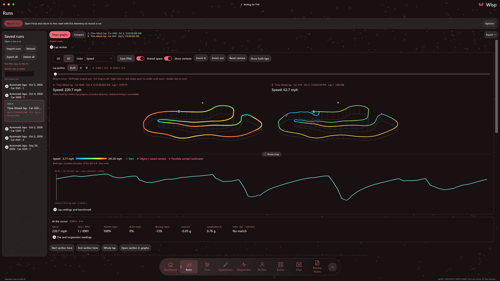

# Lap review

Review the line you drove, inspect its telemetry and compare selected sections with another lap. The map uses saved positions from your recording.

## Record and open laps

Open **Runs → Lap review**. Enable **Save completed laps automatically** to retain detailed laps while Wisp is running. Capture uses the timing mode in the HUD's lap settings: Race / Rivals laps or Time Attack. It works with the lap overlays disabled. Manual run recording remains available; older recordings need position and lap telemetry to show a driven map.

Automatic capture uses the existing lap tracker's accepted completion boundary. Joining halfway through a lap, missing telemetry, rewinding, changing car or exceeding the recording limit prevents that interrupted lap from being saved as a complete capture. Completed saves are written to the existing local run library, with its storage limits and export/removal tools. Turn the option off to stop future captures. Pending completed saves finish when Wisp closes.

## Map, channels and cursor

Choose a saved run and a lap. The map is the car's recorded path, not a supplied circuit outline or a claim about track limits. The start ring and shared cursor identify locations. Click the map or graph, use arrow keys, or move the **Lap position** slider above the map.

**2D** is the default. Switch to **3D** to view the saved XYZ positions with the same physical scale on every axis, preserving the recorded elevation changes. The ground projection helps show depth; it does not reconstruct terrain or track boundaries. Elevation values use feet when speed is set to mph and meters otherwise.

Use **Color** to choose speed, time delta, throttle, brake, steering input, lateral/longitudinal/combined G-force, RPM, gear, horsepower, torque or elevation. Tire temperature, slip ratio, raw slip angle and normalized suspension travel also have a wheel selector for the map and graph. The legend shows the channel, units and numeric range; the sample readout shows wheel values for all four wheels together. Unavailable data stays unavailable.

### 3D controls

| Input | Action |
| --- | --- |
| Click a track point | Select that location; in Shared space, move closer to that lap |
| Left-drag | Rotate |
| Shift-drag, right-drag or middle-drag | Pan |
| Ctrl-drag | Roll |
| Mouse wheel while the map has focus | Zoom |
| Arrow keys while the map has focus | Step through recorded points |
| Home / End while the map has focus | Select the first / last point |
| Double-click, R, or **Reset camera** | Reset the camera |

Right-click or click empty map space to focus it without changing the selected point. Before the map has focus, the wheel scrolls the page. **Zoom in** and **Zoom out** are also available as buttons. Picking another point on an already focused lap keeps your adjusted camera view.

Drag **Resize map** to change the map height; Wisp remembers the height when resizing ends. With the resize handle focused, Up/Down adjusts the height and Home restores automatic sizing.

**Save PNG** saves the current 2D or 3D map with its channel legend and selected-point values. It includes the current camera and Shared space view when enabled. Resize and frame the map before saving, and choose an unused filename to keep existing images.

## Sections and reference laps

Use **Start section here** and **End section here** around a corner or straight. Compare entry, minimum and exit speed, time, distance, throttle/brake/coasting fractions, G-force, RPM, gear changes and tire values. **Open section in graphs** connects the same interval to the existing Runs graph workspace. Whole-lap timing uses the recorded timing boundary; section statistics describe the actual recorded samples and their coverage.

Select Run B using the existing comparison controls, then choose its reference lap. Run B takes priority over a compatible pinned benchmark. Without Run B or a compatible pinned benchmark, the reference picker uses laps from the current run. **Pin this lap as benchmark** keeps a selected run/lap reference between Wisp sessions; rename the run and add its tune label in the normal run details. Pinning does not copy the recording, prevent its removal, or change the live HUD's session-best/previous-lap reference. If the pinned run is unavailable, choose another or unpin it.

Time delta is this lap's time minus the reference's time at matching world positions. A negative value is ahead. Route direction, continuity, start location, car and timing mode must agree, and most of both routes must match. Ambiguous or missing positions get no delta. Comparison does not establish identical tune, conditions or an officially clean lap. Existing telemetry does not provide a reliable official lap-validity flag or full track boundary.

### Shared space and independent cursors

In 3D, enable **Shared space** when two distinct laps with recorded positions are selected. It is optional and starts off. The laps are arranged beside each other in one scene, using a common physical scale and channel color range while retaining their recorded elevation. Click either track to focus it. Zoom out, choose **Show both laps**, or press Escape while the map has focus to return to the overview.

Choose **Both** to move the cursors together. Compatible comparisons follow matching track positions. When the laps cannot be matched, Both follows relative progress by recorded distance; this does not enable time delta or matched section statistics. **A** and **B** let you inspect the laps independently while keeping the other cursor fixed. Moving B independently leaves A and its graph at their selected point.

Shared space can display different cars or routes when both laps have usable positions. That visual comparison does not relax the timing and benchmark requirements above.

## Contact markers

**Show contacts** displays filled stars for recorded breakable-object evidence or existing saved Contact annotations, and hollow stars for **Possible contact (estimate)**. Object evidence comes from the game's reported breakable-object velocity loss and mass. Possible contacts are inferred from movement; they can be wrong. These markers do not establish every wall/car collision, an officially clean lap, or the absence of contact when no marker appears.

Saved or imported Contact annotations remain visible. There is no manual contact editor. Older recordings that did not retain object telemetry cannot recover that evidence retrospectively. See the [run-file format guide](run-library-format.md) for sharing and older-version compatibility.

## Why these measurements

RACELOGIC recommends locating time losses in the delta trace, then examining braking location, apex speed and the line through corner entry and exit. Wisp uses the corresponding telemetry and selected sections; it does not infer where a real apex or legal kerb lies from a bare path. [Circuit Tools guidance](https://en.racelogic.support/motorsport/discontinued-legacy/software/circuit-tools-2/kb/how-to-use-circuit-tools-to-become-faster/).

AiM's analysis workflow combines a track map with speed/RPM and other channels, synchronized cursors and time/distance analysis. That supports the shared location cursor and channel/section comparisons here. Braking and throttle traces explain how the speed trace changed; G-force and wheel channels provide context rather than a universal driving score. [RaceStudio 3 Analysis manual](https://www.aim-sportline.com/docs/racestudio3/manual/html/analysis.html).

Brake is the game's input percentage, not hydraulic pressure. Steering is an input, not steering-wheel degrees. Slip angle remains the raw game telemetry value because its physical-unit contract has not been established here. Tire temperature has no universal ideal threshold across cars and conditions. Coasting is measured, not automatically classified as a mistake. Missing channels do not become invented measurements or predicted lap-time gains.
